# 🛡️ Pardus Odak Asistanı (Pardus Focus Assistant)

Pardus ve Debian tabanlı Linux sistemleri için geliştirilmiş; verimliliği artırmak amacıyla dikkat dağıtıcı web sitelerini engelleyen, **oyunlaştırma (gamification)** tabanlı ve çift arayüz destekli bir odaklanma asistanıdır.

> **Geliştirici:** Rumeysa Ersoy  
> **Dil:** Bash Scripting (YAD & Whiptail)  
> **Özellik:** GUI & TUI Desteği + Kupa Sistemi 🏆

---

## 📸 1. Grafik Kullanıcı Arayüzü (GUI)
Modern, renkli ve fare odaklı kullanım sunan arayüz.

### 🖥️ Kurulum ve Başlangıç
Uygulama açıldığında çalışma sürenizi, mola sürenizi belirleyebilir ve "Derin Odak" modunu aktif edebilirsiniz.
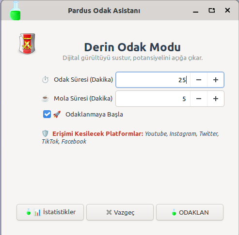

### ⏳ Akış Modu (Çalışma Zamanı)
Başlat butonuna bastığınızda geri sayım başlar. Motivasyonel mesajlarla odaklanmanıza yardımcı olur.
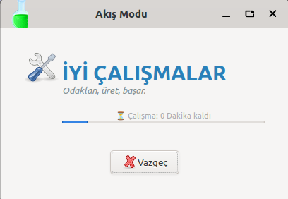

### ⛔ Erişim Engeli
Eğer "Derin Odak" modunu seçtiyseniz, çalışma süresi boyunca dikkat dağıtıcı sitelere (Instagram, YouTube vb.) erişim işletim sistemi seviyesinde kesilir.
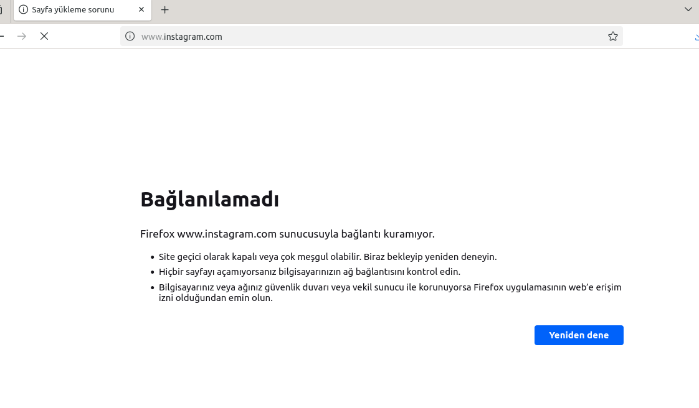

### 🎉 Hedef Tamamlandı (Başarı!)
Süreyi sonuna kadar tamamladığınızda sistem sizi tebrik eder ve hanenize **+1 Kupa (🏆)** ekler.
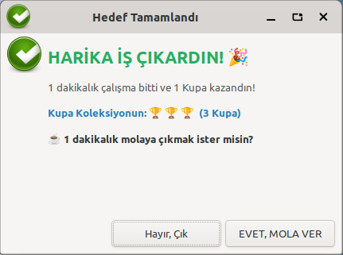

### ☕ Mola Zamanı
Başarılı bir çalışmanın ardından hak ettiğiniz dinlenme süresi başlar. Yeşil tema ile gözlerinizi dinlendirir.
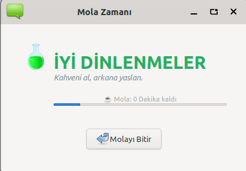

### ⚠️ Odak Bozuldu (Yarım Bırakma)
Eğer süre dolmadan "Vazgeç" butonuna basarsanız veya programı kapatırsanız:
* Çalıştığınız süre istatistiklere **eklenir.**
* Ancak **KUPA KAZANAMAZSINIZ.** (Seri bozulur)
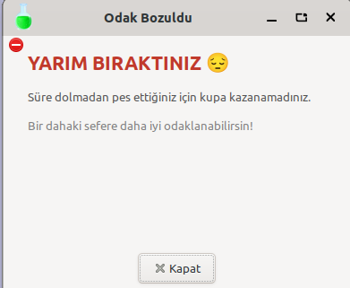

### 📊 İstatistik ve Kupa Koleksiyonu
Tüm çalışmalarınız ve kazandığınız kupalar burada sergilenir. Bilgisayarı kapatsanız bile verileriniz silinmez.
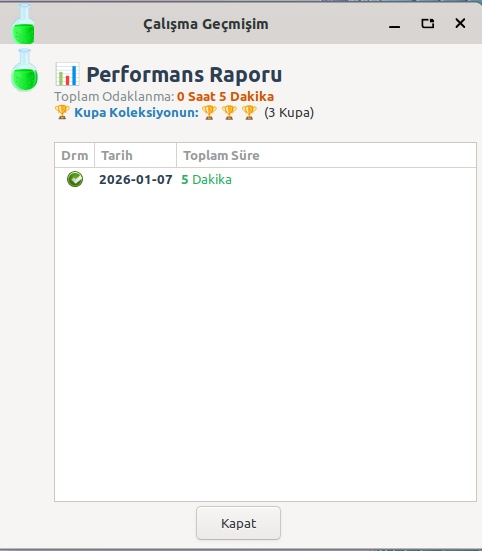

---

## ⌨️ 2. Terminal Kullanıcı Arayüzü (TUI)
Hız ve minimalizm arayanlar için klavye odaklı arayüz.

### ⚙️ Ana Menü ve Ayarlar
Terminalden çıkmadan tüm işlemleri yönetebilirsiniz.
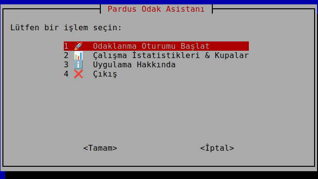

### ⏱️ Süre Ayarları
Çalışma sürenizi ve mola sürenizi adım adım girersiniz.
| Çalışma Süresi | Mola Süresi |
| :---: | :---: |
| 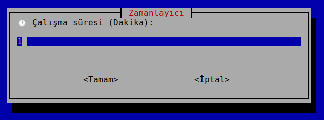 | 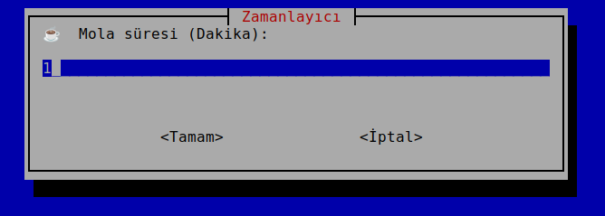 |

### 🛡️ Derin Odak Tercihi
Sitenin engellenip engellenmeyeceğini klavyeden seçersiniz.
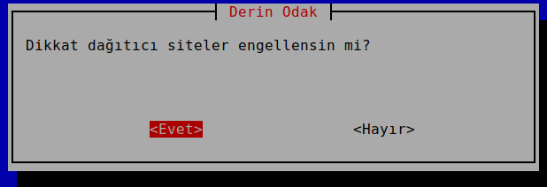

### 🚀 Odaklanma Modu (Akış)
Sade, dikkat dağıtmayan bir ilerleme çubuğu ile odaklanma süreci başlar.
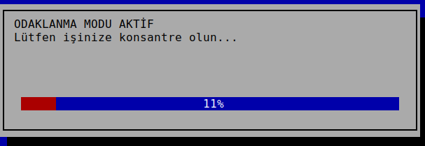

### 🏆 Tebrikler (Başarı Anı)
Süre bittiğinde terminal üzerinden başarınız kutlanır ve koleksiyonunuza yeni kupanız eklenir.
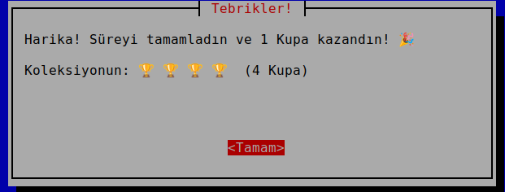

### 📈 Detaylı Rapor
Terminal ekranında bile kupa sayınızı, toplam dakikanızı ve hangi seansların "BAŞARILI" hangilerinin "YARIM" kaldığını detaylıca görebilirsiniz.
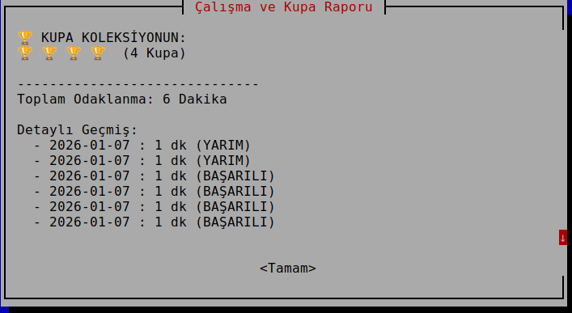

---

## 🛠️ Kurulum ve Çalıştırma

Projeyi bilgisayarınıza indirmek ve sorunsuz çalıştırmak için aşağıdaki adımları izleyebilirsiniz.

### 1. Adım: Projeyi İndirin
Öncelikle terminali açın ve proje dosyalarını GitHub'dan çekin:

```bash
git clone [https://github.com/rumeysaersoyy/pardus-odak-asistani.git](https://github.com/rumeysaersoyy/pardus-odak-asistani.git)
cd pardus-odak-asistani

### 2. Adım: Çalıştırma Yöntemi Seçin
A) Otomatik Başlatma (Önerilen 🚀)

Projede Task (Go-Task) otomasyonu bulunmaktadır. Tek bir komutla hem gerekli paketlerin (yad, whiptail) kurulumunu yapar hem de uygulamayı başlatır.

```bash
task start

B) Manuel Başlatma

Eğer task kullanmak istemiyorsanız, klasik yöntemle sırasıyla şu komutları uygulayın:

```bash
# 1. İzinleri verin ve kurulumu yapın
chmod +x install.sh main.sh lib/*.sh
./install.sh
w
# 2. Uygulamayı başlatın
sudo ./main.sh


